<div align="center">



[](https://git.io/typing-svg)

</div>

---

<div align="center">

## 🌌 About Me

</div>

```yaml
name: Vitor Mateus
location: Brazil 🇧🇷
role: Platform & Software Engineer | SRE | DevOps

focus:
  - Observability & Monitoring Pipelines
  - Cloud Native Infrastructure
  - SRE practices & Incident Management
  - Open Source Contributions

certifications:
  - PCEP — Python Certified Entry Professional
  - Oracle Cloud Infrastructure (OCI)
  - OCI AI Foundations
```

---

<div align="center">

## 🛸 Tech Universe

**🔭 Observability**


**🚀 Languages**


**☸️ Cloud & Infra**


**⚙️ CI/CD & GitOps**


</div>

---

<div align="center">

## 📡 GitHub Stats

[](https://github.com/Vitor0Mateus00)

[](https://github.com/Vitor0Mateus00)
[](https://github.com/Vitor0Mateus00)

[](https://github.com/Vitor0Mateus00)
[](https://github.com/Vitor0Mateus00)

</div>

---

<div align="center">

## 🪐 Find Me

[](https://www.linkedin.com/in/vitor0mateus00)
[](https://github.com/Vitor0Mateus00)

---


*"The universe is under no obligation to make sense to you." — Neil deGrasse Tyson*

</div>
